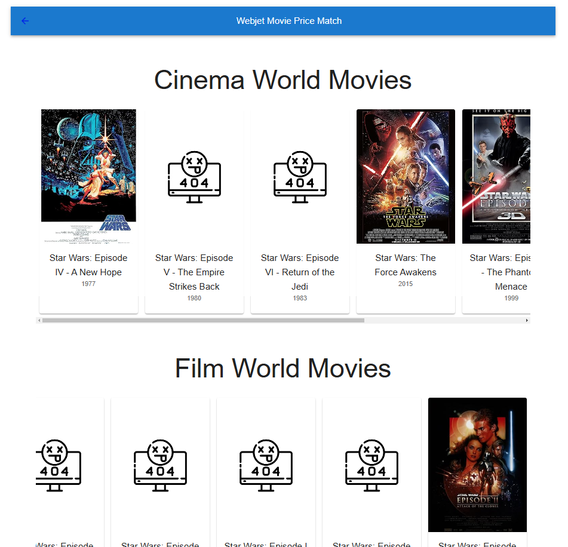
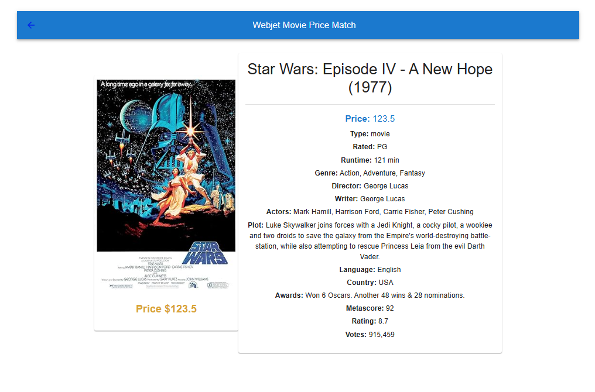

# Introduction

This mono-repo contains both the Web App and Web API for this task, they dont have the best naming conventions...

WebApp: '.\webjet-movies'

WebApi: '.\WebJetMovieApi'

# Getting Started

Web App

1. I've put the url for the web api in an enviroment variable
   - Add a .env file to the root directory and add the line 'VITE_REACT_APP_API_URL=http://localhost:5000'.
   - It is important that the variable is named the same otherwise the app wont import it correctly.
2. Make sure you are on the latest node version, I am using v22.13.1 for this project.
3. I use 'yarn' for dependancy management.
4. run 'yarn add vite@latest' (I have used Vite for the web app).
5. run 'yarn dev' to start the web app.

Web Api

1. Add the API Token to the projects appsettings.Development.json (i.e. "ApiKey": "PUT_API_KEY_HERE").
2. run the project

Hiding the API token and URL was done for security in local development, and is generally good practice to not put it in source control so I have left them out to be added by the devs locally.

# Assumptions & Notes

**API Will Periodically Be Unavailable**

Both providers api will drop at random intervals so the API and Web App needs to be able to handle it without crashing

- Add resilience to the API calls to allow the backend to retry requesting the data. I used Microsoft.Extensions.HTTP.Resilience/Polly to add its default resilience pipeline, adding a delayed retry attempt with exponential backoff.

- Added loading into the Web App for each providers data to show the user the app is still working but waiting for valid data from the API.

- If I has some more time I would add some memory caching (Redis Maybe) to make the page loading a little better when an API was down.

**Intentional Bad Data**

Some of the data will not work, for example, some of the images are not valid paths.

- For the missing image data, I thought it would be out of scope for this task to replace the data instead I added a default 404 image when the link doesn't work.

  - I debated having a single list of movies made from conjoining the two lists received from both API's and using the data from the one with the valid poster image which may have worked for this task but I felt it is not how I would handle it in a real world example and would instead fix the data comming from the API.

**Securing the API Token**

- For local development, I store the API token in the appsetting.json of the Web API and use and eviroment varaible for the url of the Web API in the Web App.

- if I were to deploy this application for production I would host it in Azure and use Key Vault for securly storing the tokens.

# Tools

For this application I used Vite, Material UI ad NewtonsoftJSON

# App Usage

**The home page displays the movies from both providers**

- Clicking and movies poster will take the user to the movies detail page.

**Movie Detail Page**

- The user can view the price of the movie for the given provider.

# Conclusion

The app layout isnt great, but I wanted to focus more on handling the bad data than designing a good UI.

If I were to expand on the UI I would combine the movies into a single list on the home page and when the user looks at the details it would show the cheapest price in comparison to the other providers.
